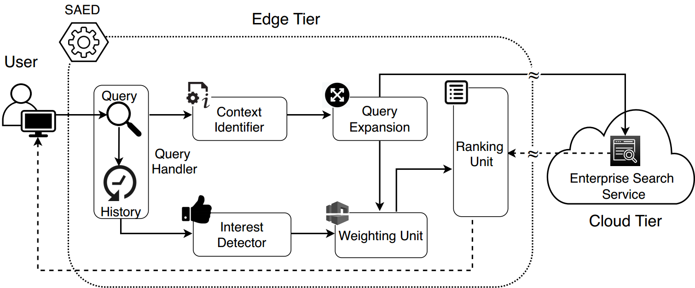

# SAED-Security-At-Edge
SAED is an edge-based platform that offers intelligence in the form of privacy-preserving semantic and personalized search at the edge tier to augment the capabilities of the Enterprise Search services on the cloud. SAED can be plugged in to any cloud-based enterprise search solution (e.g., AWS Kendra) and extend their smartness and privacy wihtout enforcing any change on them. SAED is the first platform that develops the idea of **logical partitioning of applications across edge-to-cloud continuum** in the context of a privacy-preserving search application. In particular, to preserve the user's privacy, SAED decouples the intelligence aspect of the semantic search algorithm (and performs it on a trusted edge tier) from its pattern matching aspect (that is performed on the untrusted public cloud tier).

## Availability
SAED is an open-source program that was developed at HPCC lab, University of Louisiana Lafayette. Details of its theory, implementation, and evaluation have been published in 21st IEEE/ACM International Symposium on Cluster, Cloud, and Grid Computing (CCGrid 2021) in Melbourne, Australia. 
The research paper is also available on the arXiv repository:
https://arxiv.org/abs/2102.13367

Users of this open-source platform are requested to cite the following paper in their publications:
 ````
 @inproceedings{zobaedsaed2021,
  title={SAED: Edge-Based Intelligence for Privacy-Preserving Enterprise Search on the Cloud},
  author={Zobaed, Sakib M, and Amini Salehi, Mohsen and Buyya, Rajkumar}
  booktitle={Proceedings of the 21st International Symposium on Cluster, Cloud, and Grid Computing},
  series={CCGRID'21},
  year={2021},
  month={May}
}
 ````
 
## Architecture

Architectural overview of SAED within the edge tier and (as part of the three-tier enterprise search service) is shown below. SAED provides semantic search via identifying the query context (Context Identifier module) and combining that with the user’s interests (Interest Detector module). Then, the Query Expansion module and the Weighting unit of SAED, respectively, incorporate the semantic and assure the relevancy of the results. Solid and dashed lines indicate the interactions from the user to the cloud tier and from the cloud tier to the user, respectively.
<p align="center"></p>

## Running SAED on AWS Kendra
### Dependencies
Running SAED needs the following dependencies:
 ```python>=3.5```
 ```pyenchant==3.2.0```
 ```gensim==3.8.3```
 ```numpy==1.14.2```
 ```nltk==3.2.5```
 ```pywsd>=1.2.0```
 ```yake==0.4.6```
 ```wn>=0.0.19```
 ```six>=1.11.0```
 ```pandas>=0.22.0```
 
Please refer to Step #2 from the below instructions to install the dependencies.

### Step by step Instructions
1. Clone the project on your machine via git clone.
2. To install all the dependencies all at once, run command: ```pip install -r requirements.txt``` (Make sure ```python3``` is intalled and default OS is Linux). 
3. Download pre-trained "GoogleNews-vectors-negative300.bin" W2V model from [here](https://drive.google.com/file/d/0B7XkCwpI5KDYNlNUTTlSS21pQmM/edit).
4. ```BBC``` dataset is available in zipped format in Dataset folder (demo query is considered from ```BBC``` dataset). In addition, the link for downloading RFC dataset is provided in ```Link for downloading RFC dataset.txt```. Note: here, we uploaded only the plain-text dataset for simplicity of the usage.
5. Upload data in AWS storage (S3). Please check the [documentation](https://docs.aws.amazon.com/redshift/latest/dg/tutorial-loading-data-upload-files.html) for uploading dataset in AWS storage. To configure Kendra, please check the [documentation](https://docs.aws.amazon.com/kendra/latest/dg/setup.html) if necessary. Note: Once you configure Kendra, a search index will be created. You need to copy the Kendra index id from AWS to the ```config.ini``` file as explained in the next step.  
6. Open ```config.ini``` file to provide the dataset name (BBC/RFC), W2V model location, AWS region, access key id, secret access key, and Kendra index id. We have already provided a demo query and user interest.     
7. Run ```Context_detection_extended.py```. If it needs execution persmission, please provide that accordingly. Example: 
   1. ```chmod a+x Context_detection_extended.py``` then,
   1. ```python3 Context_detection_extended.py```
8. An output file named as ```Weighted_query_"QUERY"_.txt``` will be formed. 
9. Update ```config.ini``` file with the newly generated weighted query file. Note that, we have already provided a demo file based on the demo query and interest.
10. We have provided an interface to facilitate search through AWS Kendra. Run ```Search_through_kendra.py```. If it needs execution persmission, please provide that accordingly. Before running the file, please check ```config.ini``` again and make sure that AWS related information have been provided correctly. Example: 
    1. ```chmod a+x Search_through_kendra.py```
    1. ```python3 Search_through_kendra.py```      
11. After running the file, Cloud (AWS Kendra) outputted search result is saved in ```initial_ranking.csv``` file.
12. Now, Ranking unit will be utilized to get the final search result. Run ```RankingUnit.py```. If it needs execution persmission, please provide that accordingly. Example: 
    1. ```chmod a+x RankingUnit.py``` then,
    1. ```python3 RankingUnit.py```
13. The final search result will be shown in the terminal. 
### Run SAED all-in-one 
The above instructions are provided for step-by-step execution of SAED based on the provided architecture. However, if you want to run the whole thing in one step, after Step 6, just run ```./saed_all.sh```.    
## SAED Running Instructions in the emulation mode (Without the need to configure AWS Kendra)
If you do not have an AWS account, you can simply run SAED in the emulation mode for some prepared retrieved results. This is assuming that you have a resulted document set provided by a search system (e.g., AWS Kendra) for a given search query. A dummy output obtained from Kendra is provided in ```demo_initial_ranking.csv``` file. The search query and weighted query file are loaded in ```config.ini``` file as a default. To run SAED in the emulation mode, after Step 2 in the previous section, do the following steps:
1. Run ```RankingUnit.py```. If it needs execution persmission, please provide that accordingly. Example: 
   1. ```chmod a+x RankingUnit.py``` then,
   2. ```python3 RankingUnit.py```
2. The final search result will be shown in the terminal.
